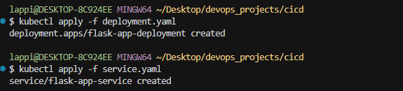
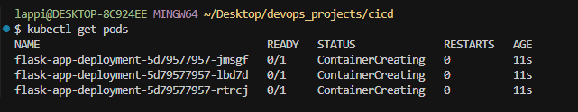
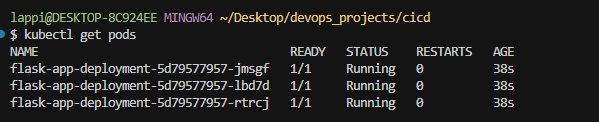

# 🚀 CI/CD with Docker & Kubernetes: A Comprehensive Guide

## 📌 Overview

In today's fast-paced software development landscape, integrating Continuous Integration/Continuous Deployment (CI/CD) with containerization tools like Docker and orchestration platforms like Kubernetes is essential. This synergy ensures rapid, reliable, and scalable application deployments.

---

## 🔄 Understanding the Core Concepts

### 1. Continuous Integration (CI)

* **Definition**: CI is the practice of automatically integrating code changes from multiple contributors into a shared repository several times a day.
* **Purpose**: To detect errors quickly, improve software quality, and reduce the time it takes to validate and release new software updates.

### 2. Continuous Deployment (CD)

* **Definition**: CD automates the release of validated code to a production environment, ensuring that software can be reliably released at any time.
* **Purpose**: To accelerate the delivery of new features and fixes to users, reducing manual intervention and potential for human error.

### 3. Docker

* **Definition**: Docker is a platform that uses OS-level virtualization to deliver software in packages called containers.
* **Purpose**: To ensure consistency across multiple development, testing, and deployment environments by encapsulating applications and their dependencies.

### 4. Kubernetes

* **Definition**: Kubernetes is an open-source system for automating deployment, scaling, and management of containerized applications.
* **Purpose**: To manage complex applications by orchestrating containers across clusters of machines.

---

## 🛠️ Setting Up the CI/CD Pipeline

### Step 1: Develop a Sample Application

Create a simple Flask application:

**`app.py`**:

```python
from flask import Flask
app = Flask(__name__)

@app.route("/")
def home():
    return "Hello, This is my first Flask App!"

if __name__ == "__main__":
    app.run(host="0.0.0.0", port=5000)
```


**`requirements.txt`**:

```
Flask
```


### Step 2: Containerize the Application with Docker

Create a **`Dockerfile`**:

```dockerfile
# Use the official Python image
FROM python:3.9-slim

# Set working directory
WORKDIR /app

# Install dependencies
COPY requirements.txt .
RUN pip install -r requirements.txt

# Copy application code
COPY . .

# Expose the application's port
EXPOSE 5000

# Run the application
CMD ["python", "app.py"]
```


Build and run the Docker image:

```bash
docker build -t flask-app .
docker run -p 5000:5000 flask-app
```


Access the application at `http://localhost:5000`.

----

----

### Step 3: Push the Docker Image to a Registry

Tag and push the image to Docker Hub:

```bash
docker login
docker tag flask-app your-dockerhub-username/flask-app:latest
docker push your-dockerhub-username/flask-app:latest
```


### Step 4: Define Kubernetes Deployment and Service

**`deployment.yaml`**:

```yaml
apiVersion: apps/v1
kind: Deployment
metadata:
  name: flask-app
spec:
  replicas: 3
  selector:
    matchLabels:
      app: flask-app
  template:
    metadata:
      labels:
        app: flask-app
    spec:
      containers:
      - name: flask-app
        image: your-dockerhub-username/flask-app:latest
        ports:
        - containerPort: 5000
```


**`service.yaml`**:

```yaml
apiVersion: v1
kind: Service
metadata:
  name: flask-app-service
spec:
  selector:
    app: flask-app
  ports:
    - protocol: TCP
      port: 80
      targetPort: 5000
  type: NodePort
```


Apply the configurations:

```bash
kubectl apply -f deployment.yaml
kubectl apply -f service.yaml
```
----

----

Get the pods:

```bash
kubectl get po
```
----

----

----
### Step 5: Automate with GitHub Actions

Create a **`.github/workflows/ci-cd.yml`** file:

```yaml
name: CI/CD Pipeline

on:
  push:
    branches:
      - main

jobs:
  build:
    runs-on: ubuntu-latest
    steps:
      - name: Checkout code
        uses: actions/checkout@v2

      - name: Set up Docker Buildx
        uses: docker/setup-buildx-action@v1

      - name: Log in to Docker Hub
        uses: docker/login-action@v1
        with:
          username: ${{ secrets.DOCKER_USERNAME }}
          password: ${{ secrets.DOCKER_PASSWORD }}

      - name: Build and push Docker image
        uses: docker/build-push-action@v2
        with:
          push: true
          tags: your-dockerhub-username/flask-app:latest

  deploy:
    needs: build
    runs-on: ubuntu-latest
    steps:
      - name: Set up Kubeconfig
        run: |
          mkdir -p $HOME/.kube
          echo "${{ secrets.KUBECONFIG_B64 }}" | base64 -d > $HOME/.kube/config

      - name: Deploy to Kubernetes
        run: |
          kubectl apply -f deployment.yaml
          kubectl apply -f service.yaml
```

Unsure how to get the KUBECONFIG_B64 locally the command and copy:

```bash
base64 ~/.kube/config
```


**Note**: Ensure that `DOCKER_USERNAME`, `DOCKER_PASSWORD`, and `KUBECONFIG_B64` are added to your repository's secrets.

---

## ✅ Conclusion

Integrating CI/CD pipelines with Docker and Kubernetes streamlines the development and deployment process, ensuring rapid delivery and scalability. By following this guide, you can set up a robust pipeline that automates building, testing, and deploying your applications.
